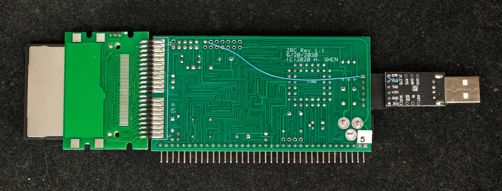
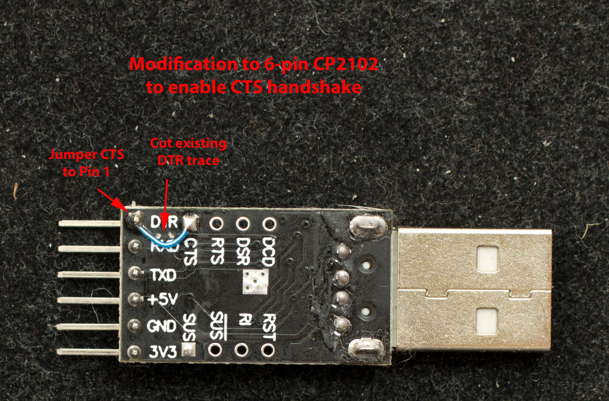

# ZRC Rev1.1 Engineering Changes

Hardware handshake is required for xmodem file transfer for ZRC. Two engineering changes are needed to enable hardware handshake.

### RTS from ZRC to serial port
The RTS function is implemented in CPLD, but a physical connection is required from CPLD's internal logic to a pin on the serial port header. A wire should be added from pin 1 of the serial header (pin 1 is a square pad) to test point T10

### CTS from USB-serial adapter to serial port
A corresponding connection is needed on the USB-serial adapter to connect RTS to CTS. The existing pin 1 is connect to DTR which needs to be cut and a short wire connects pin 1 to CTS.

