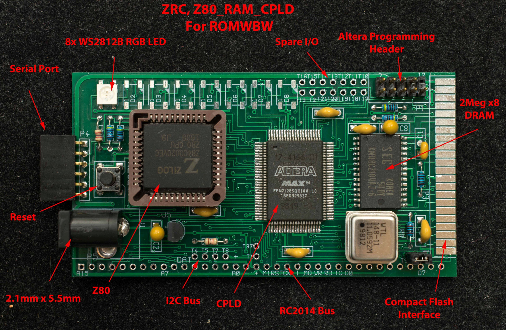
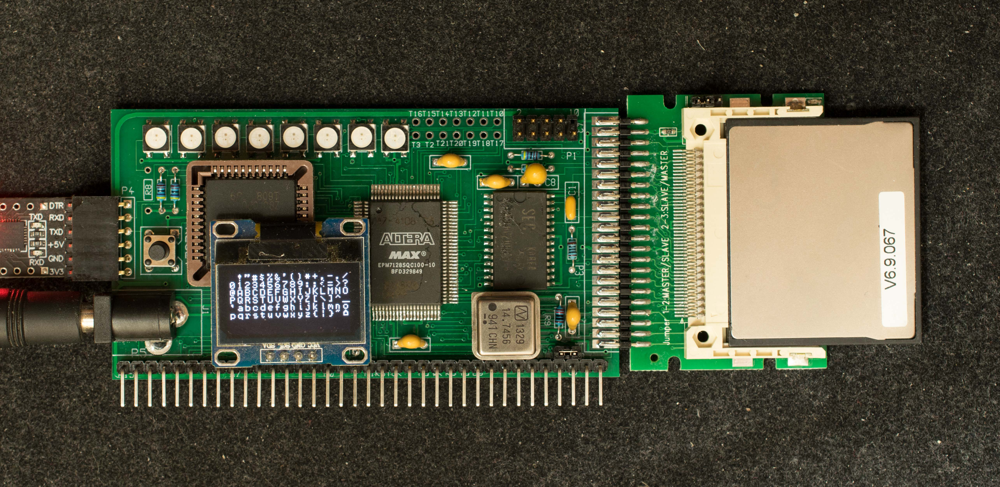
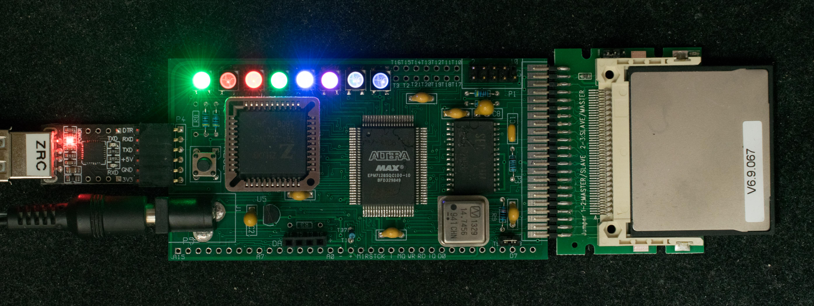

ZRC is derived from the ZoRC experiment. The basic notion is that large RAM and fast serial upload enable a diskless CP/M SBC. However, just in case that idea didn't work out, ZRC has an optional compact flash interface. The targeted software for ZRC is ROMWBW.

### Features
- Z80 at 14.7MHz
- 2 meg x 8 DRAM
- EPM7128SQC100 CPLD
  - Emulate MC6850 serial port
  - DRAM controller
  - 64 banks of 32K RAM
  - Glue logic
- Compact Flash interface
- RC2014 Bus Interface
- I2C Bus
- 8 WS2812B RGB LED
- Inexpensive 2-layer PC board

### Theory of Operation
ZRC contains a small 64-byte ROM in CPLD. On power or reset, the 64-byte ROM occupies memory location 0x0-0x3F. The ROM code polls the serial port on CPLD for incoming data and stores 256 bytes of binary data on memory location 0xB000-0xB0FF. After the 256th byte is stored, the program jumps to location 0xB000. The ROM will perform the polling of the serial port for about 4 seconds after power or reset. If no serial data are received at the end of the 4 seconds, it will sample the compact flash interface for CF busy flag. If CF is not busy, it will read in 256 bytes from the master boot sector (track 0, sector 1) and execute it. If CF is busy, it will jump to RAM location 0xB000.

In summary, ZRC has three bootstrap methods:

1. Serial bootstrap, where 256-byte bootstrap program is loaded via serial port during the 4-second countdown period. The serial port setting is 115200 N-8-1 with RTS/CTS hardware handshake
2. CF bootstrap, where 256-byte bootstrap program located in Master Boot Record (track 0, sector 1) of the CF disk is loaded into 0xb000 and run
3. RAM bootstrap, where Z80 transfer the program control to 0xb000 when no serial bootstrap is received and when CF disk is not present.

The 256-byte program can be any program, but is normally a small Intel Hex file loader which can load more sophisticated software into memory and then executes it. This is the serial bootstrap process by which ZRC loads and runs application software. ZRC may have an optional compact flash disk where programs can be stored and loaded into ZRC much faster than serial interface. For ZRC with compact flash disk, the ROM program can be updated so it polls the serial port for few seconds for updated software or load software from CF drive if no serially updated software is found.

The targeted application software for ZRC is ROMWBW. ROMWBW requires 512K of RAM and 512K of ROM, a serial port such as MC6850, and bank select register. The 512K of RAM and ROM can fit in the 2 meg DRAM, assuming the DRAM is first loaded with the ROMWBW image; the CPLD can emulate MC6850 and bank select register. (to be continued….)

### Design Files
- [Schematic](zrc_rev1_1_scm.pdf)
- [Gerber photoplots](zrc_rev1_3_gerber.zip) ← updated 2/5/24 for rev1.3 pc board
- [CPLD equation](zrc_pcb_v1_3_14_7mhz_rts_ws2812.zip) ← updated 2/5/24 for rev1.3 pc board
- CPLD schematic in PDF format
  - CPLD [top schematic](zrc_rev1_3pcb_cpld_design_file_top_scm.pdf)
  - CPLD [serial transmit](zrc_rev1_3pcb_cpld_design_serial-transmitter_scm.pdf) schematic
  - CPLD [serial receive](zrc_rev1_3pcb_cpld_design_serial-receiver_scm.pdf) schematic
  - CPLD [WS2812 driver](zrc_rev1_3pcb_cpld_design_ws2812_scm.pdf) schematic
  - CPLD [DRAM controller](zrc_rev1_3pcb_cpld_design_dram-controller_scm.pdf) schematic
- [~~Engineering changes~~](Rev1_1EC.md) to add hardware handshakes← Engineering changes not required for rev1.3 pc board

- [Modification to 6-pin CP2102](Modification_to_CP2102.md) USB-serial adapter to accept CTS handshake

- [Memory map](ZRC_memory_map.md)

### Software
- [ROMCPLD](software/ZRC_rev1_64byteROM_in_CPLD.zip), 64-byte bootstrap ROM resides in CPLD
- [Serial loader](software/zrc_rev1_software_zrserloader.zip), 256-byte program loaded by ROMCPLD into 0xB000. ← load the binary file ZRSerld.bin
- [ZRCMon](software/ZRC_rev1_software_zrcmon_v07.zip), rev0.7,
- [ROMWBW for ZRC](software/ZRC_rev1_software_RomWBW_intelHEX.zip). This is ROMWBW binary image converted to Extended Intel Hex file to be loaded into ZRC
### Manuals
- Getting started with ZRC.
- Creating new CF disk for ZRC
- Quartus Design file of a simple serial port.

Construction blog of a ZRC

### ZRC in action
[15-second video](https://www.youtube.com/watch?v=OkKbqTN_fvo) of ZRC booting into ROMWBW, https://www.youtube.com/watch?v=OkKbqTN_fvo

ZRC driving 128×64 OLED display over I2C bus

ZRC driving WS2812B RGB LED with 14.7MHz clock as well as 7.37MHz Z80 clock, see [Google Forum posts](https://groups.google.com/g/retro-comp/c/L3W7TaDnX5A). <– need to document it fully.

30-pin SIMM memory tester
ZRC modified to test 30-pin SIMM memory. Rev2 of ZRC is based on this prototype.

## ToDo
photo of ZRC ver1.3.  Explain the difference of version 1.1 and 1.3.  What about v1.2?
