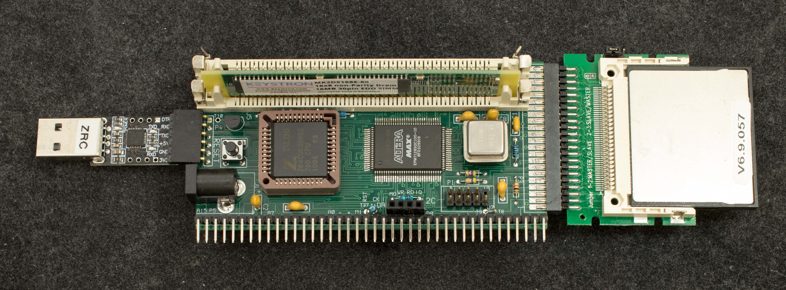

ZRC rev2 uses SIMM30 memory as its main memory. It can accommodate up to 32 meg memory.  Rev2 is derived from ZRC [SIMM30 memory tester](../SIMM30_memory_tester) prototype

### Features
- Z80 at 14.7MHz
- Dual SIMM-30 sockets
- EPM7128SQC100 CPLD
- Emulate MC6850 serial port
- DRAM controller
- 256 banks of 32K RAM
- Glue logic
- Compact Flash interface
- RC2014 Bus Interface
- I2C Bus
### Design Files
- Schematic
- Gerber photoplots
- CPLD design files
- Bill of Materials
- Memory map

### Software
- ROMCPLD, 64-byte bootstrap ROM resides in CPLD
- Serial loader, 256-byte program loaded by ROMCPLD into 0xB000. ← load the binary file ZRSerld.bin
- ZRCMon, rev0.7,
- ROMWBW for ZRC. This is ROMWBW binary image converted to Extended Intel Hex file to be loaded into ZRC
