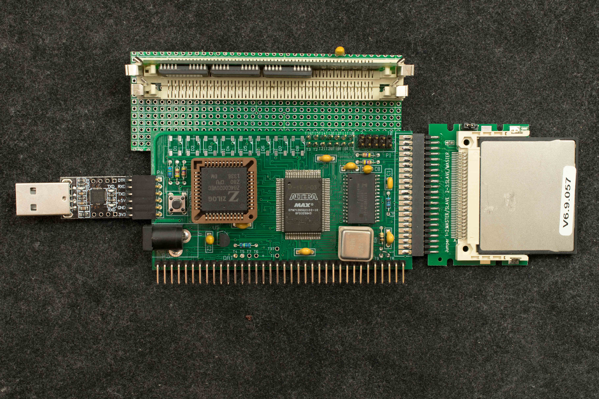
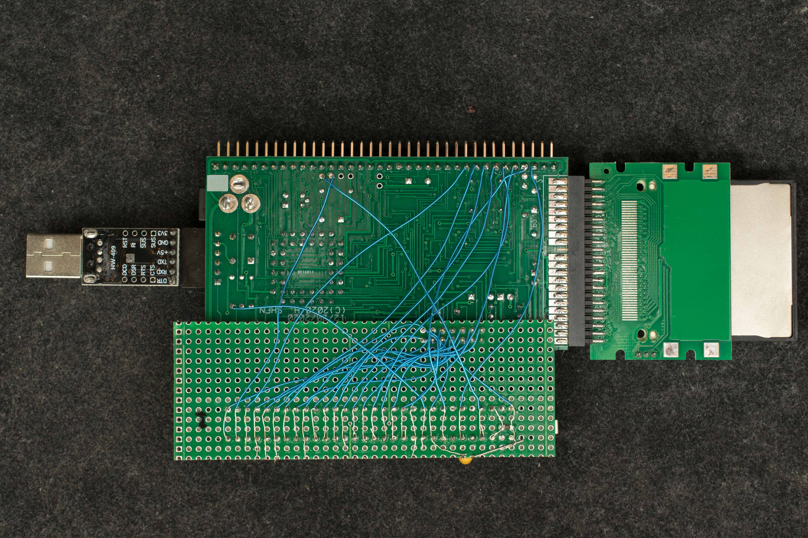

# ZRC Rev1 SIMM30 memory tester
ZRC modified to test 30-pin SIMM memory sticks
I purchased big lot of memory sticks many years ago. Among them is about 30 30-pin SIMM memories. I've modified a ZRC to test these memories.

Engineering Changes
Two SIMM30 sockets are ganged together:

|SIMM pins	|Signal Names	|ZRC Signals|
|---|---|---|
|1	|5V	|T2|
|2	|nCAS	|T5|
|3	|D0	|RC2014-27|
|4	|MA0	|T11|
|5	|MA1	|T12|
|6	|D1	|RC2014-28|
|7	|MA2 |T13|
|8	|MA3	|T14|
|9	|GND	|T3|
|10	|D2	|RC2014-29|
|11	|MA4	|T15|
|12	|MA5	|T16|
|13	|D3	|RC2014-30|
|14	|MA6	|T17|
|15	|MA7	|T18|
|16	|D4	|RC2014-31|
|17	|MA8	|T19|
|18	|MA9	|T20|
|19	|MA10	|T21|
|20	|D5	|RC2014-32|
|21	|nWE	|R8-2|
|22	|GND	|T3|
|23	|D6	|RC2014-33|
|24	|MA11	|NC|
|25	|D7	|RC2014-34|
|26	|	|NC|
|27	|nRAS	|T4|
|28	|Parity RAS	|4.7K pull up|
|29	|	|NC|
|30	|5V	|T2|

CPLD Modifications
Since ZRC already has a 2megx8 DRAM, the mulitplexed addresses for DRAM are duplicated to drive T11-T21 (MA0-MA10). The RAS, CAS, and WE to DRAM are also duplicated in T4, T5, R8-2, respectively. The control lines to onboard 2megx8 DRAM is negated, so ZRC runs from the SIMM30 memory.

CPLD design files

b
